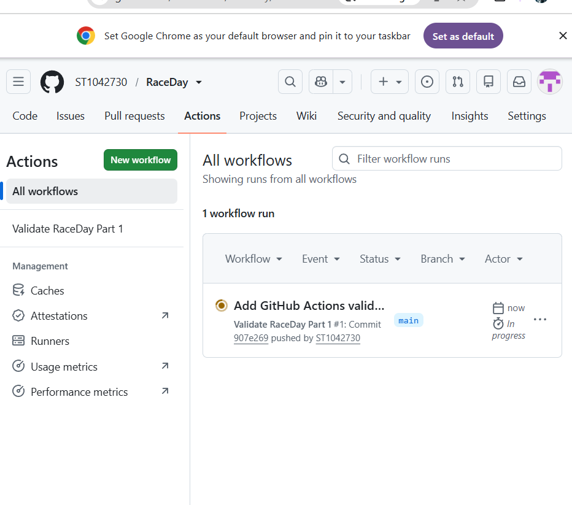

# RaceDay

RaceDay is a web-based event management system designed for road running, walking and cycling events in South Africa. The system allows event organisers to manage events while participants can browse events, enrol in categories and track their results.

## User Roles

### Organiser
Organisers can:
- Create, edit and delete events
- Manage event categories
- View participant enrolments
- Capture participant results

### Participant
Participants can:
- Create an account and log in
- Browse available events
- Enter an event by selecting a category
- View their own event enrolments
- View and track their personal results

## Part 1 - Planning and Database Design

Part 1 contains the planning and database design for the RaceDay system.

The `/docs` folder contains:
- RaceDay ERD
- API Endpoint Plan
- SQL Server database script

## Database

The RaceDay database was developed and tested using Microsoft SQL Server and SQL Server Management Studio (SSMS).

The database contains the following main entities:
- Users
- Events
- Categories
- EventCategories
- Enrolments
- Results
- EventRoutes
- EventWeather
  ## Project Structure

RaceDay/
- .github/workflows/ – GitHub Actions CI/CD workflow
- docs/ – Part 1 planning and database documentation
- README.md – Project overview and documentation

The docs folder contains the ERD, API endpoint plan, SQL database script and CI/CD evidence.
## Technologies Used

The following technologies and tools are used in the development of RaceDay:

- Microsoft SQL Server – database management
- SQL Server Management Studio (SSMS) – database development and testing
- GitHub – source control and project repository
- GitHub Actions – CI/CD workflow
- diagrams.net – Entity Relationship Diagram design
- Microsoft Word – API endpoint planning documentation
## CI/CD

GitHub Actions is used as part of the project's CI/CD process.

## Part 1 Deliverables

The following Part 1 requirements have been completed:

- [x] Entity Relationship Diagram (ERD)
- [x] API Endpoint Plan
- [x] SQL Server Database Script
- [x] Sample Database Data
- [x] GitHub Actions CI/CD Workflow
- [x] CI/CD Evidence Screenshot
- [ ] Video Demonstration
## Video Demonstration

YouTube Video: To be added.
